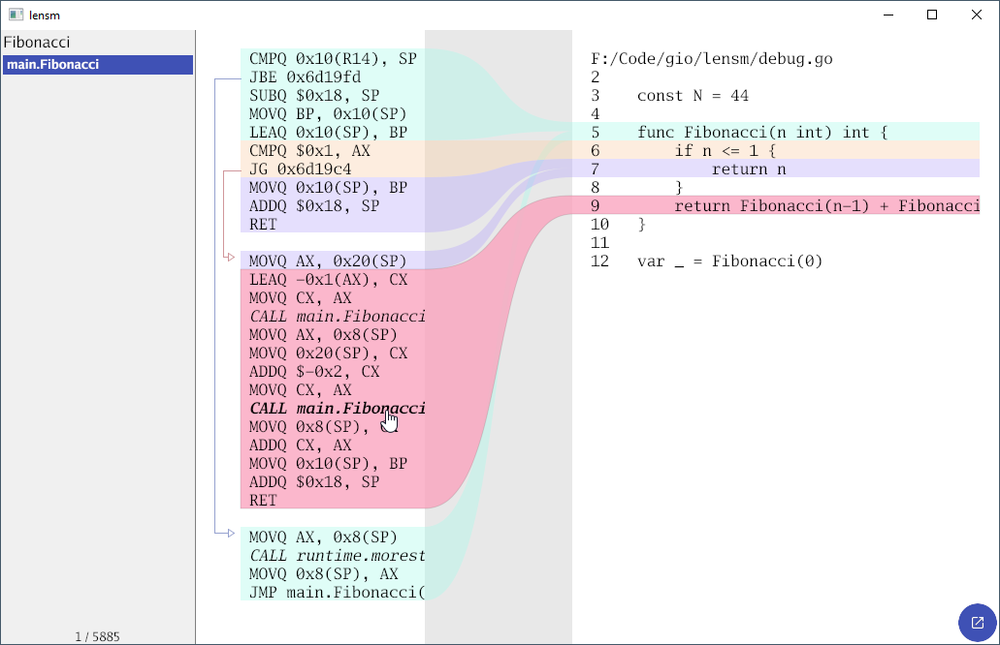

# lensm

A tool for viewing assembly and source.



Install with the usual Go commands:

```
go install loov.dev/lensm@main
```

To run the program provide a regular expression filter for the
symbol you want to inspect. `-watch` allows to automatically
reload the executable and information when it changes.

```
lensm -watch -filter Fibonacci lensm
```