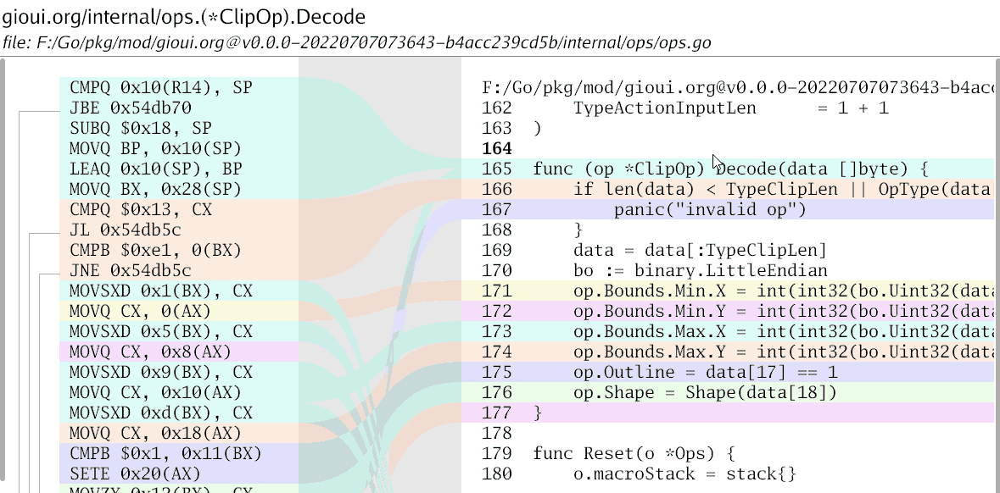

# lensm

A tool for viewing assembly and source.



Install with the usual Go commands:

```
go install loov.dev/lensm@main
```

_For Linux you may need to add some [additional dependencies](https://gioui.org/doc/install/linux). You can use `go install --tags nowayland loov.dev/lensm@main` or `go install --tags nox11 loov.dev/lensm@main` respectively to skip building Wayland or X11 version._

To run the program provide a regular expression filter for the
symbol you want to inspect. `-watch` allows to automatically
reload the executable and information when it changes.

```
lensm -watch -filter Fibonacci lensm
```

Note: The program requires a binary that is built on your computer, otherwise the source code for the functions cannot be loaded.

## Why?

I wrote a blog post at https://www.storj.io/blog/lensm on why and how the core functionality works.
