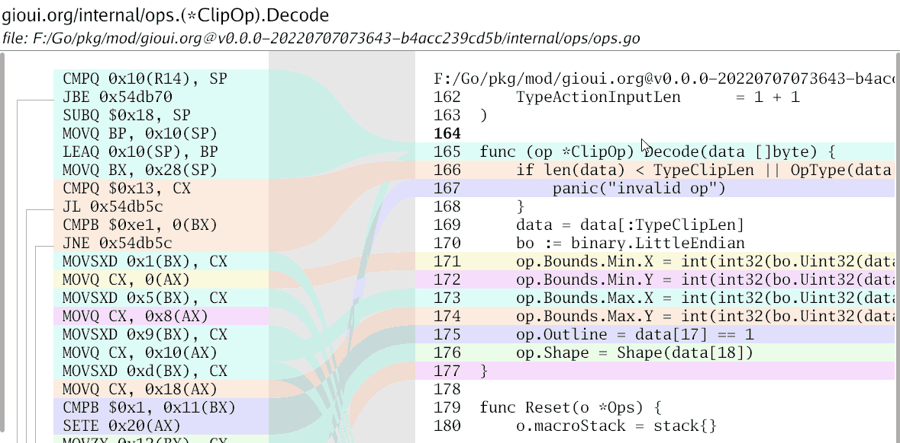

# lensm

A tool for viewing assembly and source.



Install with the usual Go commands:

```
go install loov.dev/lensm@main
```

_For Linux you may need to add some [additional dependencies](https://gioui.org/doc/install/linux). You can use `go install --tags nowayland loov.dev/lensm@main` or `go install --tags nox11 loov.dev/lensm@main` respectively to skip building Wayland or X11 version._

Build this checkout locally:

```
go build -o lensm .
```

GitHub Actions also builds installable macOS disk images for Apple Silicon
and Intel. Download the DMG artifact from a successful CI run, open it, and
drag `Lensm.app` to Applications. CI builds use an ad-hoc signature, so macOS
may require the first launch through **Control-click → Open**.

To build the DMG locally on macOS:

```
./scripts/build-macos-dmg.sh 0.0.0 1 "$(go env GOARCH)"
```

On Linux, use the same Gio tags if you want to skip a windowing backend:

```
go build -tags nowayland -o lensm .
go build -tags nox11 -o lensm .
```

Run the program with an executable path, or start it without arguments
and load an executable from the top bar. On macOS, use Choose... to select
the executable with the native Finder file dialog. The function filter is
available inside the UI. `-watch` allows to automatically reload the
executable and information when it changes.

```
lensm -watch lensm
```

Inside the code view:

- follow call targets and use `Alt+Left/Right` (or `Cmd/Ctrl+[` and
  `Cmd/Ctrl+]`) to navigate between functions;
- hover an assembly instruction to see its reference and a simplified
  explanation when Lensm has a matching rule;
- drag across Go assembly, native assembly, or source lines to select a block,
  then use `Cmd/Ctrl+C` to copy it. `Shift` extends a selection and
  `Escape` clears it.

Run lensm as an MCP server over stdio:

```
lensm mcp [-context 3] [-comments ./lensm.lensm-comments.json] ./lensm
```

The MCP server exposes tools for listing functions, reading a function's
Go source, Go assembly and native assembly, and reading or writing comments.
By default comments are stored in a sidecar file named
`<executable>.lensm-comments.json`.

Note: The program requires a binary that is built on your computer, otherwise the source code for the functions cannot be loaded.

## Why?

I wrote a blog post at https://www.storj.io/blog/lensm on why and how the core functionality works.
