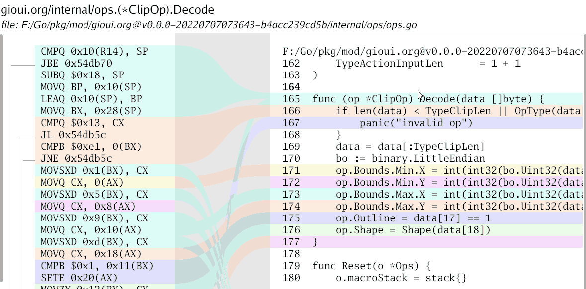

# lensm

A tool for viewing assembly and source.



Install with the usual Go commands:

```
go install loov.dev/lensm@main
```

_For Linux you may need to add some [additional dependencies](https://gioui.org/doc/install/linux). You can use `go install --tags nowayland loov.dev/lensm@main` or `go install --tags nox11 loov.dev/lensm@main` respectively to skip building Wayland or X11 version._

Build this checkout locally:

```
go build -o lensm .
```

GitHub Actions also builds installable macOS disk images for Apple Silicon
and Intel. Download the DMG artifact from a successful CI run, open it, and
drag `Lensm.app` to Applications. CI builds use an ad-hoc signature, so macOS
may require the first launch through **Control-click → Open**.

To build the DMG locally on macOS:

```
./scripts/build-macos-dmg.sh 0.0.0 1 "$(go env GOARCH)"
```

On Linux, use the same Gio tags if you want to skip a windowing backend:

```
go build -tags nowayland -o lensm .
go build -tags nox11 -o lensm .
```

Run the program with an executable path, or start it without arguments
and load an executable from the top bar. On macOS, use Choose... to select
the executable with the native Finder file dialog. The function filter is
available inside the UI. `-watch` allows to automatically reload the
executable and information when it changes.

```
lensm -watch lensm
```

Inside the code view:

- follow call targets and use `Alt+Left/Right` (or `Cmd/Ctrl+[` and
  `Cmd/Ctrl+]`) to navigate between functions;
- hover an assembly instruction to see its reference and a simplified
  explanation when Lensm has a matching rule;
- drag across Go assembly, native assembly, or source lines to select a block,
  then use `Cmd/Ctrl+C` to copy it. `Shift` extends a selection and
  `Escape` clears it.

Run lensm as an MCP server over stdio:

```
lensm mcp [-comments ./lensm.lensm-comments.json] ./lensm
```

The MCP server exposes tools for listing functions, reading a function's
Go source, Go assembly and native assembly, and reading or writing comments.
By default comments are stored in a sidecar file named
`<executable>.lensm-comments.json`.

When the GUI and a separate `lensm mcp` process write the same sidecar,
saves merge per comment: each process's additions, edits, and deletions
survive, and only conflicting edits to the same comment resolve to the
last writer. The merge is read-then-write without a file lock, so two
saves landing in the same instant can still lose one side's changes.
Comments are keyed by function name, not by binary: point `-comments` at
one shared file only for builds of the same program.

Binaries from other compilers work too. Functions come from the symbol
table and source from DWARF, so a C or C++ program built with `-g` shows
its source alongside the assembly; on macOS the debug info lives in the
`.dSYM` bundle next to the binary, which is read automatically. C++ and
Rust symbols are demangled — for C++ the signature is kept, so overloads
stay apart. A function is listed under the file it was written in, which
for heavily inlined code is not the file its first instruction belongs to.

Note: The program requires a binary that is built on your computer, otherwise the source code for the functions cannot be loaded.

WebAssembly modules (`GOOS=wasip1 GOARCH=wasm`, TinyGo, or any `.wasm`) are
recognised by their magic bytes and shown as WAT, one instruction per line
with calls resolved to function names. Source comes from whichever line
table the module carries. Go embeds a pclntab in its data segments, which
records a position per resume point rather than per instruction, so a run
of instructions between two resume points shares one line. TinyGo and
clang emit DWARF instead, which is per statement. All of TinyGo's wasm
targets work. A `wasip2` build is a component rather than a plain module,
so its functions come from the core modules nested inside it and are
listed under the module they belong to, as in `main/main.sumInts`.

Microcontroller builds work too. TinyGo's Cortex-M targets (`pico`, `pico2`,
`feather-m4`, `teensy40`, ...) produce Thumb code, which is decoded by a
disassembler generated from ARM's architecture reference XML — Thumb-1,
Thumb-2 and the floating-point extension, IT blocks included, with branch
targets resolved to function names and the literal pools inside functions
shown as `.word` data. 32-bit RISC-V targets such as the ESP32-C3 are
decoded with the RISC-V decoder; AVR (`arduino`, `attiny`, ...) and Xtensa
(`esp32-*`, `nodemcu`, `d1mini`) by decoders of their own, in the syntax
of the GNU objdump for each.

## Why?

I wrote a blog post at https://www.storj.io/blog/lensm on why and how the core functionality works.
